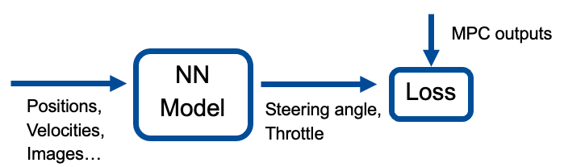

# Practical Course Learning For Self-Driving Cars and Intelligent Systems WS21: Truck Platooning
This repository is truck platooning based on model predictive control (MPC) and tested in the Carla simulator. The main concept of this project is to first design a model predictive controller that generates control values for the ego vehicles, then train a neural network by using mpc outputs as ground-truth labels.

The framework of our project is as following:

Many different inputs are tested for training the neural network, including raw states (x-/y-coordinates, yaw angles, velocities) for both vehicles, relative states, RGB images, RGB and depth images and stereo images. The goal of this project is to design a network using inputs that are available in reality.

## Structure of repository

Dataset and scripts for this project is stored under `/storage/remote/atcremers51/truck_platooning/`

Three main notebooks include all the codes written for this project, the helper functions and model architectures are imported in these notebooks.
- `Data_Collection.ipynb` contains all data collection and preprocessing methods for different models, the corresponding folder is `data_collection`.
  1. Online CARLA collection with random positions
  2. Data collection for CNN-MLP model with depth camera
  3. Data collection for CNN-MLP model with stereo camera
- `Training_Pipeline.ipynb` contains codes for training different models, the model architectures are imported into this notebook, the corresponding folder is `model`.
  1. Data Preparation
  2. Build the model
  3. Train the model
- `Test_Pipeline.ipynb` contains codes of inference the results in the CARLA simulator, including the evaluations as well, the corresponding folder is `test_evaluation`.
  1. Test inference
  2. Evaluation

## The required Python dependencies

- python = 3.7
- matplotlib>=3.5.1  
- numpy>=1.21.5
- opencv-python>=4.5.4
- torch>=1.10.0
- torchvision>=0.11.1
- xlutils>=2.0.0
- xlrd>=2.0.1
- scipy>=1.7.1
- pillow>=8.4.0
- json>=2.0.9
- scikit-image>=0.19.1
- pytorch3d>=0.6.1
- CARLA 0.9.11

For installation of pytorch3d, you can refer to [Pytorch3d - Tutorial](https://pytorch3d.org/tutorials/bundle_adjustment)

For installation of CARLA 0.9.11, you can refer to [CARLA 0.9.11](https://github.com/carla-simulator/carla#building-carla)

### Licences
**CARLA licenses**

CARLA specific code is distributed under MIT License.

CARLA specific assets are distributed under CC-BY License.

## Usage Example
### How to run
You can run the three notebooks, `Data_Collection.ipynb`, `Training_Pipeline.ipynb` and `Test_Pipeline.ipynb` to see how we collect data, train the models and do inferences. 

**NOTE**: Both the `Data_Collection.ipynb` and the `Test_Pipeline.ipynb` should be copied to the folder in Carla 0.9.11: `/Carla_0.9.11/PythonAPI/examples/`, as well as their corresponding folders `data_collection` and `test_evaluation` for running, since some cells require the Carla environment.

### Results
Here are some results tested by our model in the CARLA simulator:

Result tested with CNN-MLP model with depth camera on an unseen trajectory with sharp turns.

Result tested with CNN-MLP model with depth camera on an unseen trajectory, with some random impulses applied to the ego vehicle.

Result tested with CNN-MLP model with stereo camera on an unseen trajectory, with 2 following vehicles.

More videos can be found in the [Results Truck Platooning](https://syncandshare.lrz.de/getlink/fiFyLGH5PvnfGPKorSXtX8x7/Final%20Result%20Truck%20Platooning). We can see from the videos, that our model managed to predict reasonable control values of the ego vehicles in most scenarios, even though there are some random impulses applied on the ego vehicle or multiple ego vehicles.

The final model uses images captured with depth camera and stereo camera, with off-trajectory data generated by image rendering methods, which are realizable in the real world.

